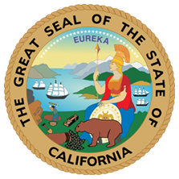

# Pre-Qualified Vendor Pool for Agile Development - Digital Services 2018 Refresh 

In February 2018, the California Department of Technology (CDT) will conduct a Request for Interest (RFI) to refresh the Pre-Qualified Vendor Pool for Agile Development - Digital Services (PQVP AD-DS) that was established in July 2016. 

The pool is designed to provide approved state agencies with access to user-centric design and agile software development services.

### The Benefits:
* Reduction in solicitation time and administrative costs for both the State and vendors
* Ability to review vendors’ user-centric design and agile software development competencies prior to solicitation

### The Process:
CDT has released a draft of the RFI (see above files), to elicit feedback and/or comments from the vendor community.  CDT advises all interested parties, including incumbent vendors, to thoroughly review the draft RFI and provide any feedback and/or comments by the due date indicated in Section A.1 PQVP AD-DS, Key Action Dates.    

### [PQVP AD-DS Refresh Request for Interest (RFI)](https://github.com/CDTProcurement/adpq/blob/master/Pre-Release%20RFI%20CDT-PQVP-0118%20-%20Pre-Qualified%20Vendor%20Pool.pdf)

### The Results:
CDT will release an Offical RFI in February 2018, that may incorporate feedback received.
 
### Vendor Pool Questions & Issues:
If you have any questions or issues, please email the PQVP Team at adpq@state.ca.gov.
 
